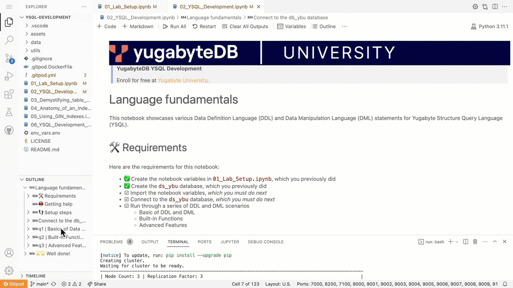

# YSQL Development

[YugabyteDB](https://www.yugabyte.com/) is the leading open source, distributed SQL database. The database has two APIs: YCQL and YSQL.

This repository is a lab resource in the free, **YugabyteDB YSQL Development** course from Yugabyte University.

> **YugabyteDB YSQL Development**
>
> Enroll for **FREE** at ...
> [Yugabyte University](https://university.yugabyte.com/).
>

---

To start the Gitpod environment, which is also free to use, select the link below. All you need is a Github account.

Gitpod is an on-demand developer environment for a GitHub, Git, or BitBucket workspace. It's super easy to use, offers 50 hours of free use per month, and only requires a chromium based browser.

Using Gitpod, you can run the notebook files in an on-demand VS Code, browser based environment. 😎

This repository contains the notebook files for YSQL Development, a free course that is soon-to-be available at [university.yugabyte.com](https://university.yugabyte.com).

Using Gitpod, you can run the notebook files in an on-demand VS Code, browser based environment.

## New to Github and Gitpod? Here's how to start...

- First, create a Github account. It's free. [https://github.com/join](https://github.com/join)
Then, in a browser, open the Gitpod link for the GitHub repository. It's a prefix -  gitpod.io/# - and entire URL for the repository. For example, `gitpod.io/#https://github.com/gitpod-io/websit`e
- Optionally, to make this a seamless one click installation, install the Gitpod browser extension. To learn more about the extension, see [https://www.gitpod.io/docs/browser-extension](https://www.gitpod.io/docs/browser-extension)
- You will need to authorize Gitpod to use your GitHub account. Select Authorize gitpod.io.
- Select your default editor, VS Code Browser. Select Continue.
- Depending on the image configuration, it may take a few minutes for the image to build and to deploy to workspace.

### FAQS

**Will this repository or similar be made available at github.com/yugabyte?**
- Currently, no. Gitpod is not available for the Yugabyte account.

**What is Gitpod?**
- Gitpod is a free developer service that makes it easy for maintainers to automate any non-executable setup instructions as code. Gitpod is part of Github.com. Gitpod launches pre-configured containers for a given project. 
  
**How much does Gitpod cost?**
- Gitpod is free for the first 50 hours of usage for a given month. To learn more, see [https://www.gitpod.io/pricing](https://www.gitpod.io/pricing).

**How can I sign up for Gitpod?**
- Sign up for a Github.com account.
- To install the Gitpod browser extension, check out [https://www.gitpod.io/docs/quickstart#installing-the-gitpod-browser-extension](https://www.gitpod.io/docs/quickstart#installing-the-gitpod-browser-extension).

**How do I start?**
- Simply select this link: [https://gitpod.io/#https://github.com/YugabyteDB-University/YSQL-Development](https://gitpod.io/#https://github.com/YugabyteDB-University/YSQL-Development)

**OK, it started, BUT the ybu-lab terminal shows errors. What can I do???**
- There should be some helpful error messages, but in spite of that, you can run two scripts:
  - `start_all.sh` starts yugabyted and accepts 1 argument with zero or 1 value: `zone`, `region`, or `cloud`
  - `stop_and_destroy_all.sh` kills all the nodes.
- Here's how to force the fix and get things back on track in the `ybu-lab` terminal:
  - 1) `cd $GITPOD_REPO_ROOT`
  - 2) `.\stop_and_destroy_all.sh`
  - 3) `.\start_all.sh region`

**I'm still running into issues. Where can I find help and support?**
- You can ask questions our community Slack in the #training channel at [YugabyteDB Community Slack](https://join.slack.com/t/yugabyte-db/shared_invite/zt-xbd652e9-3tN0N7UG0eLpsace4t1d2A/).

---
### Release notes
Notes regarding updates to this repository.
- 2023.12.21
  - start_all.sh and stop_and_story_all.sh, scripts to help manage the yugabyted deployment
  - added css styling for HTML output to align left for query plans
- 2023.11.29
  - Update for 2.19.2
  - Use `yugabyted` instead of `yb-ctl`
- 2023.09.14
  - Move dependencies
  - Add gif
- 2023.06.30
  - Update for 2.19
- 2023.05.10
  - added more index uses cases 
  - add GIN indexes
  - add built-in functions to geo-partitioning
- 2023.05.07
  - Update for 2.17.3
  - Replace `curl` with `wget` for `fn_yb_tserver_metrics_snap()` in `util_ybtserver_metrics.sql`. This works in Gitpod now.
- 2023.04.20
  - Update notebooks with emojis
  - Added Kill connections with drop of databases
